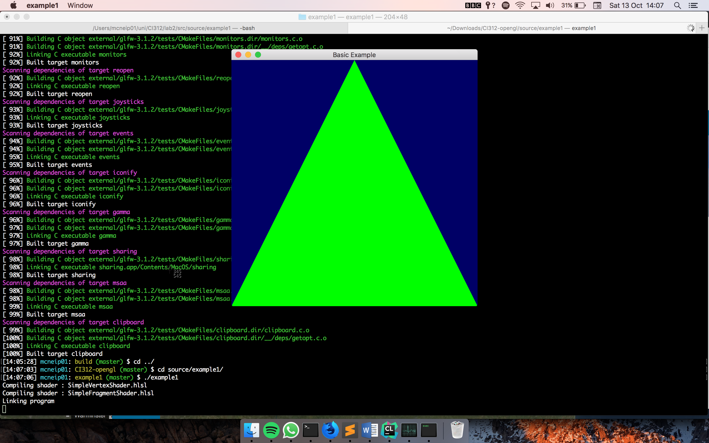
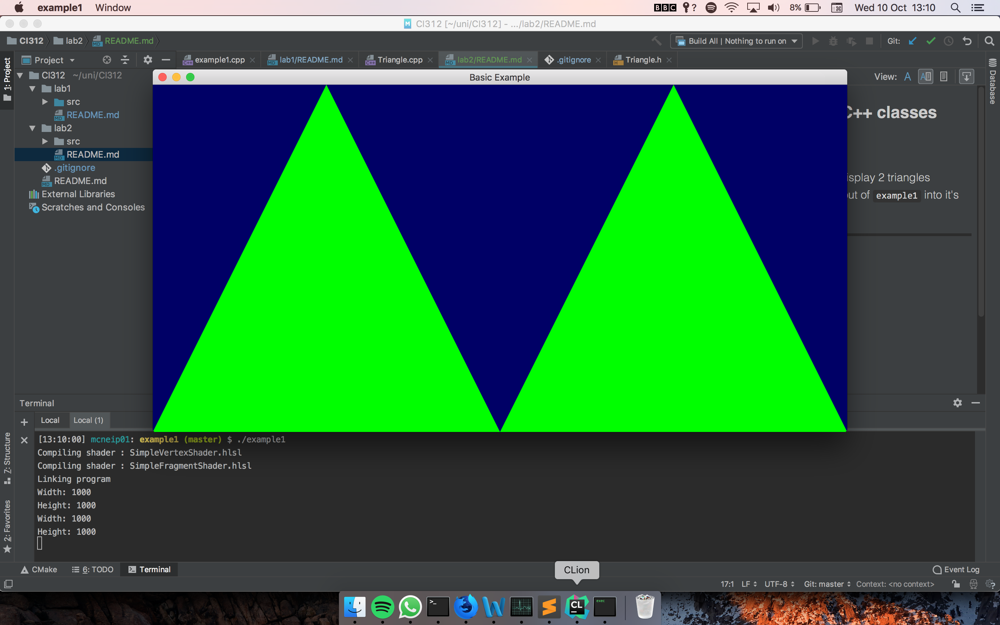

### Lab 2: OpenGL and C++ classes

[Code for this lab found](https://github.com/petermcneil/CI312/tree/master/lab2/), however it is recommended you
clone the whole repository.

#### Requirements:
    
* Modify the `example1.cpp` to display 2 triangles
* Extract the drawing function out of `example1` into it's own class

[Source code found and adapted from Karia Rodriguez](https://github.com/karina-rodriguez/CI312-opengl)

---
#### Journey

I began this lab by downloading the source files and building the binary.
As I have never used CMake before this was a interesting experience.


I am used to the managed build systems of Gradle/Maven where it acts as a package manager
as well as a build system for JVM projects, in C++ this is different. CMake is the tool
we used for this lab - however I understand there are variety of different build
systems for C++. CMake generates cross-platform Makefiles and Makefiles are used for
to run the compile commands for the C++ binary.


Since the [source project](https://github.com/karina-rodriguez/CI312-opengl) had already
set up a CMake task, in the form of `CMakeLists.txt`, all that was needed to setup the
project was to `cmake` in the target build directory.


This initially threw me off as I tried to run `cmake` inside the source folder (`src`).
However CMake is expecting that you run the `cmake` command inside of the build directory.
Therefore I made a build directory and ran it in there.

From there I was able to run `make` on the generated `Makefile` and it spit out a
binary called `example1`. In my naivety I tried to run `example1` in the build folder.
The compiler then threw a runtime dependency error as it could not find the shaders. 
My first thought would be that they would be added to the compiled binary, however
it seems that shaders can be swapped out at will.

Once I ran the file in the correct directory I saw the expected program:



From here I decided to get moving with adding an extra triangle to the screen. Being
unfamiliar with OpenGL and C++ it was difficult to read what was happening in the file.
I could see that there was a window being set up and a viewport added to the window.

```cpp
//Creating a window
window = glfwCreateWindow(width, height, "Basic Example", NULL, NULL);

...

//Adding a viewport to the window
glViewport(xpos, ypos, width, height);

```

Apart from that it was difficult for me to work out what was going on. I could
see that in the while loop was where the triangle was being added. I tried playing
around with the loop. I tried copying indivdual lines of code that I thought were necessary,
however this was to no avail.

I asked the tutor to walk me through what was happening with this while loop
and she informed me that I would need to repeat ALL of the code inside the loop
to add a new triangle. And that's what I did!



Then I decided to tackle classes. I extracted out the drawing function from the 
`do/while` loop and created a class called Triangle

```cpp
class Triangle {
private:
    int width;
    int height;
    int xpos;
    int ypos;
    GLuint vertexbuffer;
    GLuint colorbuffer;

public:
    Triangle(int wid, int hei, int x, int y, GLuint vertex, GLuint color);
    void draw();
    ~Triangle();
};
```

This included all the important variables necessary for the drawing. I also
had the chance to write myself a class, having never done so in C++. As in all
C-like languages there was a familar syntax, but also differences. For example
in C++ there is no garbage collection, so if you would like a class
to destroy itself when you stop using it you must write a `destructor`, which
in my case looked like:

```cpp
Triangle::~Triangle() {
    cout << "\nTriangle is being deleted" << endl;
}
```

Once this class was written in `Triangle.cpp` I could then reference it
in the `example1.cpp` by adding an include statement - `#include "Triangle.cpp"`.
Instantiating an object then became as easy as `Triangle t1(width, height*2, 0, 0, vertexbuffer, colorbuffer);`
and a method call was `t1.draw();`. However I had first tried to instantiate a 
`Triangle` the Java way with `Triangle t2 = new Triangle(width, height*2, width, 0, vertexbuffer, colorbuffer);`.
This didn't work the way I expected as the `new` keyword actually returns a pointer, however
methods for the object can still be accessed via `t2->draw();`
 
Finally I decided to work on implementing a header file. A header file can be seen
as C++ way of doing interfaces. In there we provide the "outline" of a class
or methods, and other files do the actual implementation. For our purposes the
header file ended up looking like this:

```cpp
#ifndef GLTUTORIALS_TRIANGLE_H
#define GLTUTORIALS_TRIANGLE_H

#include <GL/glew.h>
class Triangle {
private:
    int width;
    int height;
    int xpos;
    int ypos;
    GLuint vertexbuffer;
    GLuint colorbuffer;

public:
    Triangle(int wid, int hei, int x, int y, GLuint vertex, GLuint color);
    void draw();
    ~Triangle();
};

#endif
```

To stop the Triangle interface being defined twice or more in our program we use guards. 
These are in the `#ifndef GLTUTORIALS_TRIANGLE_H` lines that we haven't seen before. 

Writing an implementation of this interface is easy, all that is needed is `#include "Triangle.h"` at the top
of the file. However when I tried to compile the program with this new header file, I was thrown
this error:

```bash
Undefined symbols for architecture x86_64:
  "Triangle::draw()", referenced from:
      _main in example1.cpp.o
  "Triangle::Triangle(int, int, int, int, unsigned int, unsigned int)", referenced from:
      _main in example1.cpp.o
  "Triangle::~Triangle()", referenced from:
      _main in example1.cpp.o
ld: symbol(s) not found for architecture x86_64
clang: error: linker command failed with exit code 1 (use -v to see invocation)
```

This baffled me for ages. I couldn't really understand what was going on. I had the source
files all set up correctly but the compiler didn't have any idea of my `Triangle.cpp`. It took
me a while to realise that the Makefile wasn't compiling my implementation (`Triangle.cpp`) and therefore
couldn't link the header file (`Triangle.h`) to anything. The solution to this problem was
to add the implementation to the CMakeLists.txt.

```cmake
add_executable(example1 
	${SRC_FILES}		
	source/example1/example1.cpp
	source/example1/Triangle.cpp
	...
	)
```

---
#### Final product
Input:

```
make lab2
```

Output:


---
#### Conclusion

I enjoyed this exercise and deeper dive into C++. I have learnt a lot and am looking forward
to using this language more. I understand a basic build pipeline for C++ and 
have worked on using classes/header files.

OpenGL seems like an interesting library/framework to use and learn alongside the graphics 
algorthim work coming up .

---
#### Sources
[Stack Overflow](https://www.stackoverflow.com/)

[Tutorials Point](https://www.tutorialspoint.com/cplusplus)

University of Brighton intranet/lectures


