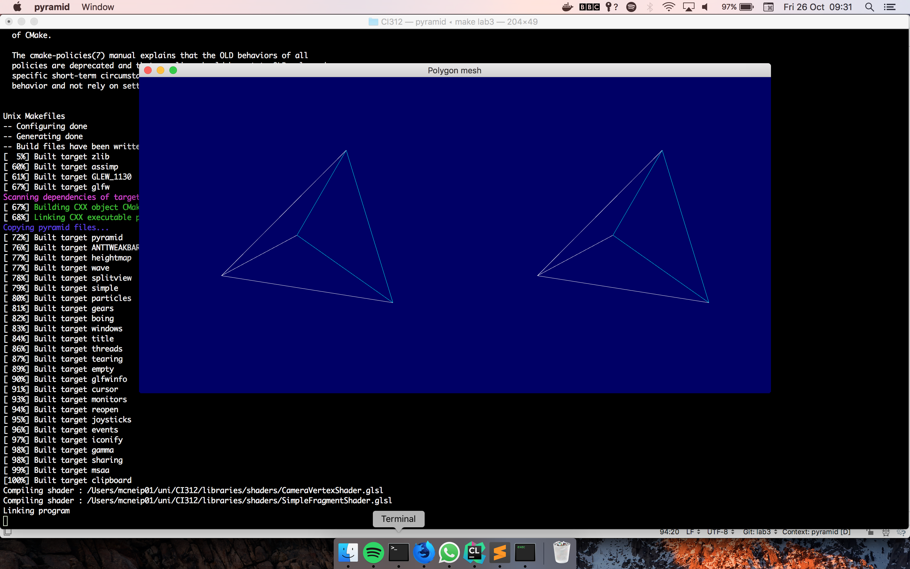
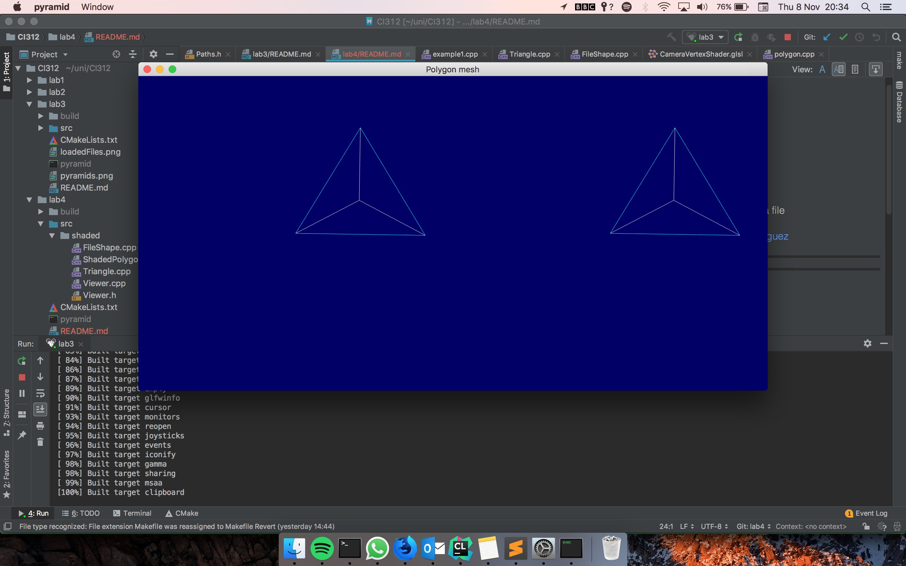
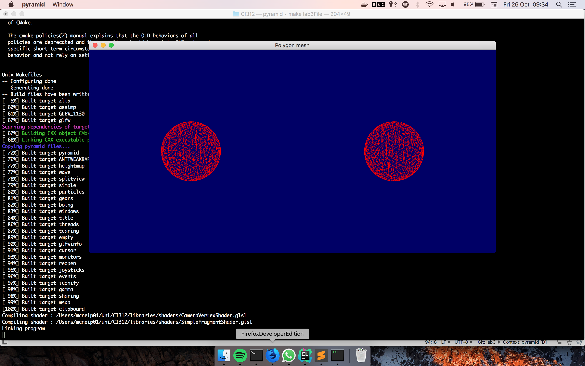

### Lab 3: Polygon Meshes

[Code for this lab found](https://github.com/petermcneil/CI312/tree/master/lab3/), however it is recommended you
clone the whole repository.

#### Task

1. Understand geometry in example file
2. Creating a 3D geometry
3. Implementing the geometry
4. Changing the camera view
5. (Extension) Load a 3D polygonal mesh from a file

[Source code found and adapted from Karia Rodriguez](https://github.com/karina-rodriguez/CI312-opengl)

---
#### Journey

1.
GL_ARRAY_BUFFERS
GL_TRIANGLES

3 vertices
3 colours

2. 
GL_ARRAY_BUFFERS
GL_TRIANGLES

12 vertices
3 colours


**3. Implementing the geometry**

I first started by grabbing a pen and piece of paper, drawing the current
triangle I had written during lab 2. I had trouble picturing where the triangles  
were, so I moved them to both start drawing at (0,0) in their respective viewports. 
The triangles were now at a good starting point for me to visualise.

Starting at the bottom left corner I labelled the coordinates on the triangle, getting
(0,0), (1,0), (0,1) for all three vertices. I drew the connecting edges on the paper to help 
visualisation. From here I marked the midpoint of the triangle, drew 3 more lines to 
simulate the additional triangles.

Using the formulae from the provided file I was able to generate the 3 vectors needed for 
each of the 4 triangles. In addition I changed the hard-coded value to a variable;

The resulting vectors became:
```cpp
    static const GLfloat g_vertex_buffer_data[] = {
            //Base Triangle
            z, z, z,
            s, z, z,
            s / 2, h, z,
            //Triangle 1
            z, z, z,
            s / 2, h / 3, H,
            s / 2, h, z,
            //Triangle 2
            s, z, z,
            s / 2, h / 3, H,
            s / 2, h, z,
            //Triangle 3
            z, z, z,
            s / 2, h / 3, H,
            s, z, z,
    };
```

Resulting in



**4. Changing the camera view**
To change the camera I edited the values in the camera matrix:
```cpp
        glm::mat4 View = glm::lookAt(
                glm::vec3(s/2, H/3, s*3), // Camera is at (0,0,-1), in World Space
                glm::vec3(0, 0, 0), // and looks at the origin
                glm::vec3(0, 1, 0)  // Head is up (set to 0,-1,0 to look upside-down)
        );
```

I settled on the above vec as it meant we could see the pyramid head on.



**5. Load a 3d polygonal mesh from a file**

For the final task I imported the 3d file mesh. This required me to implement a new Viewer, `FileShape.cpp`.
To get this to work I copied the code from the tutorial and abstracted the path to my `Paths.h`.



To make sure I could access both viewers I implemented a boolean condition:

```cpp
int main(int argc, char* argv[]) {
    bool triangle = argc <= 1;
    
    ...
    
   if(triangle){
        t1 = new Triangle(width, height * 2, 0, 0, vertexbuffer, colorbuffer);
        t2 = new Triangle(width, height * 2, width, 0, vertexbuffer, colorbuffer);
    } else {
        t1 = new FileShape(width, height * 2, 0, 0, vertexbuffer, colorbuffer, sphere_asset);
        t2 = new FileShape(width, height * 2, width, 0, vertexbuffer, colorbuffer, sphere_asset);
    }
```

If there was any argument to the compiled binary the program uses the file.

---
#### Repo cleanup
I noticed that for my folder structure I was having to copy all
the common code and libraries. Therefore this lab I performed extensive refactoring of the code and 
layout of files. I managed to extract the common libraries and shaders
into a parent directory called `libraries`. This allowed me to have a
cleaner, smaller repo and keeps it DRY (Don't Repeat Yourself).

This required me to edit the `CMake` files to allow for a parent `libraries` project.
It was easier than I had expected, the majority of what needed to be changed
was the paths. Changing these to relative paths (i.e `../../libraries/common`) worked
well.

I also extracted hardcoded paths to the shaders to a common file and using `sed`
have provided a way to setup the project to the specific directory. In addition I
added a `Makefile` to give the user easy building of my project, only requiring a small command `make lab1`.

---
#### Final Product

Input:
```bash
make lab3
...
make lab3File
```

Output:


---
#### Conclusion

I found the introduction into 3D vectors difficult and it required a few sessions to get the program to work
as expected. From the tutorial I gained experience in using vectors and visualising in a 3D space. I feel more
confident working with OpenGL primitives and shaders, with hopefully more experience to come.

---
#### Sources
[Stack Overflow](https://www.stackoverflow.com/)

[Tutorials Point](https://www.tutorialspoint.com/cplusplus)

University of Brighton intranet/lectures

