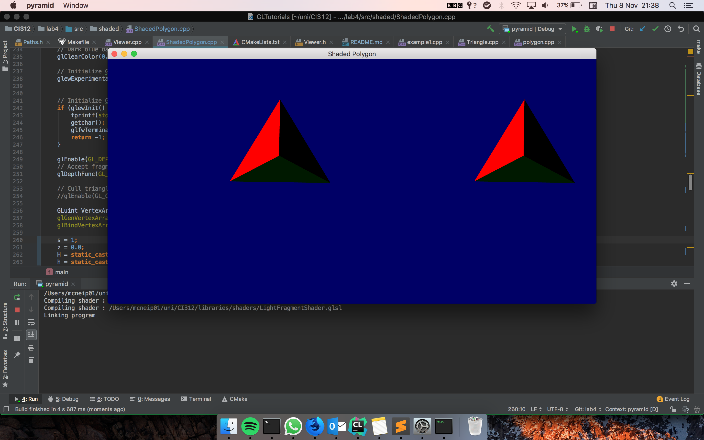

### Lab 4: Implementing normals

[Code for this lab found](https://github.com/petermcneil/CI312/tree/master/lab4/), however it is recommended you
clone the whole repository.

#### Task

1. Compute the normals of your mesh
2. Add the normals to the vertex buffer
3. Using new shaders for lighting
4. Define the light and camera positions

[Source code found and adapted from Karia Rodriguez](https://github.com/karina-rodriguez/CI312-opengl)

---
#### Journey

I started by extracting out the functions to display different types of shape/shaded/lighting.
This was to aid readability inside the class. From here I had a good base to get started calculating the normals.

Normals are used by lighting shaders and give the shaders the direction a particular point is looking at in relation to the light
source. To calculate the normals a few calculations had to be made. A base point had to be picked on each triangle - `p0`. 
Then two vectors were calculated for that triangle - i.e. `p1 - p0`. To have a vector that can be normalised I calculated
the cross-product between the two vectors. This returns a vector perpendicular to the vectors, which can then be normalised.
Resulting in the code:

```cpp
    glm::vec3 t3_norm = glm::normalize(glm::cross(glm::vec3(t3_p1 - t3_p0),
                                                  glm::vec3(t3_p2 - t3_p0)));
```

Following this process for the next three triangles I ended up with a normal buffer array, `normals`,
```cpp
    static const GLfloat normals[] = {
            //Base Triangle
            base_norm.x, base_norm.y, base_norm.z,
            base_norm.x, base_norm.y, base_norm.z,
            base_norm.x, base_norm.y, base_norm.z,
            ...
    };
```

which were then drawn by the shaders - `LightFragmentShader` and `LightVertexShader`. The normal buffer may look
strange, it is using the same value for each three vector points. This is due to the fact, as previously mentioned,
the normal will be the same across the face so is just repeated.

After some tweaking with the shaders as detailed in the tutorial and some tidy up of code I had the finished product of
the of pyramid lit up. Changing the position of the light source with the line `glm::vec3 lightPosition(-1, -1, -1);`.



---
#### Final Product

Input:
```bash
make lab4
```

Output:


---
#### Conclusion
I found this tutorial useful in giving me an overview on how lighting works in OpenGL and more generally with
graphics algorithms. I learnt how vectors and normals can be used in conjunction with shaders to produce realistic
lighting scenes.

---
#### Sources
[Stack Overflow](https://www.stackoverflow.com/)

[Tutorials Point](https://www.tutorialspoint.com/cplusplus)

University of Brighton intranet/lectures

