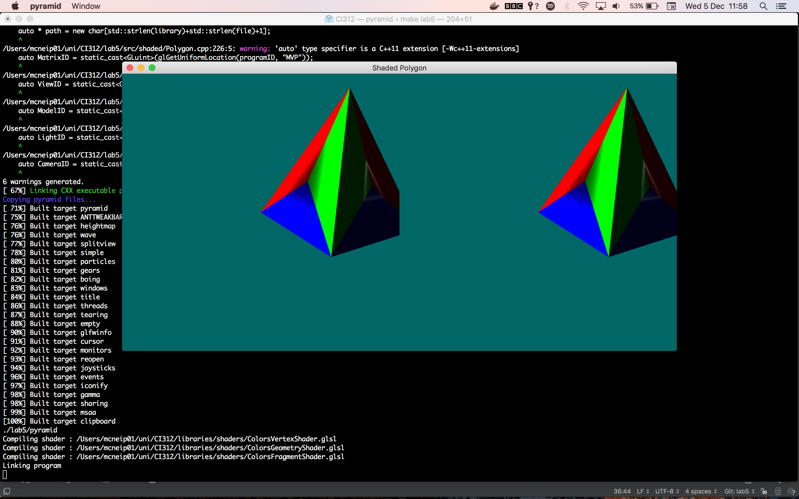

### Lab 5: Manipulation of polygons using shaders

[Code for this lab found](https://github.com/petermcneil/CI312/tree/master/lab5/), however it is recommended you
clone the whole repository.

#### Task

1. Update shaders
2. Look at shaders
3. Use the shaders to draw 3 extra triangles per face

[Source code found and adapted from Karia Rodriguez](https://github.com/karina-rodriguez/CI312-opengl)

---
#### Journey

Tackling this problem I first tried finding the centre of the triangle being rendered and generating
vectors based from that.

```glsl
  vec4 centre = (gl_in[2].gl_Position + gl_in[1].gl_Position + gl_in[0].gl_Position) / 3;
```

This can then be used as a point to generate a 3 new triangles.

```glsl
  //triangle 1
  v1 = gl_in[0].gl_Position;
  v2 = gl_in[1].gl_Position;
  v3 = centre;

  drawTriangle(v1, v2, v3, vec3(1.0, 0.0, 0.0));

  //triangle 2
  v1 = gl_in[0].gl_Position;
  v2 = gl_in[2].gl_Position;
  v3 = centre;

  drawTriangle(v1, v2, v3, vec3(0.0, 0.0, 1.0));

  //triangle 3
  v1 = gl_in[1].gl_Position;
  v2 = gl_in[2].gl_Position;
  v3 = centre;

  drawTriangle(v1, v2, v3, vec3(0.0, 1.0, 0.0));
```
`drawTriangle` was a function that takes in three vectors and a colour vector and emits the primitive.

However this method did not work the way I expected... changing nothing.


This will need more investigation.

After consulting with Karina, I was able to fix this problem. The way I was calling the `drawTriangle()` function meant
that I was drawing the same triangle (initial triangle) three times. As a fix, I had to re-imagine how to 
calculate the Removing this revealed the three triangles that I was trying to draw.



As can be seen there is an error with the code resulting in shadows around the centre points. I am 

---
#### Final Product

Input:
```bash
make lab5
```

Output:


---
#### Conclusion
I enjoyed using GLSL shaders to draw three additional triangles in replacement for the original face.

---
#### Sources
[Stack Overflow](https://www.stackoverflow.com/)

[Tutorials Point](https://www.tutorialspoint.com/cplusplus)

University of Brighton intranet/lectures

