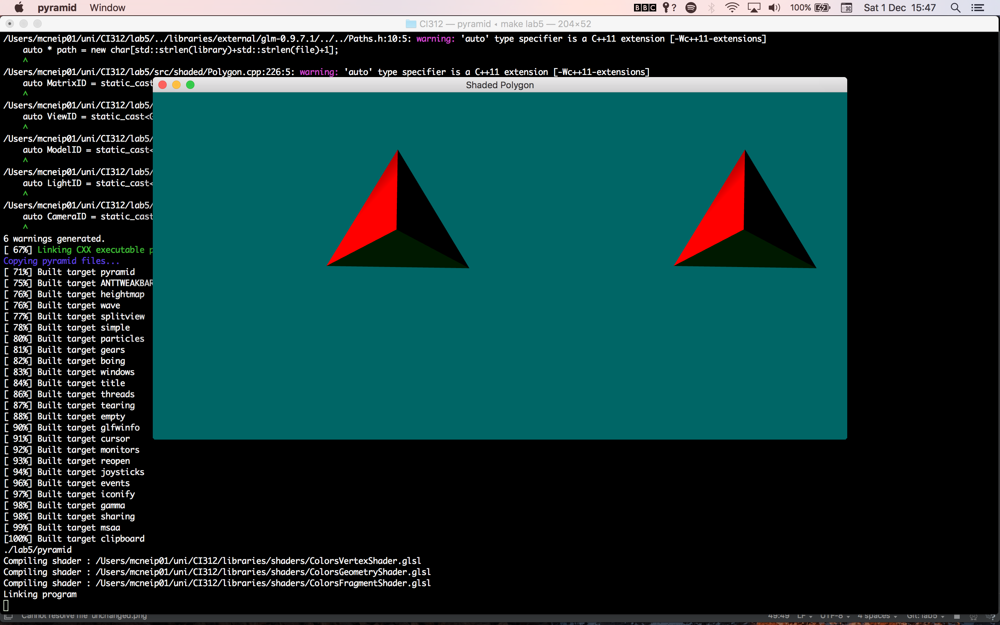

### Lab 5: Manipulation of polygons using shaders

#### Task

1. Update shaders
2. Look at shaders
3. Subdivide triangle

[Source code found and adapted from Karia Rodriguez](https://github.com/karina-rodriguez/CI312-opengl)

---
#### Journey

Tackling this problem I first tried finding the centre of the triangle being rendered and generating
vectors based from that.

```glsl
  vec4 centre = (gl_in[2].gl_Position + gl_in[1].gl_Position + gl_in[0].gl_Position) / 3;
```

This can then be used as a point to generate a 3 new triangles.

```glsl
  //triangle 1
  v1 = gl_in[0].gl_Position;
  v2 = gl_in[1].gl_Position;
  v3 = centre;

  drawTriangle(v1, v2, v3, vec3(1.0, 0.0, 0.0));

  //triangle 2
  v1 = gl_in[0].gl_Position;
  v2 = gl_in[2].gl_Position;
  v3 = centre;

  drawTriangle(v1, v2, v3, vec3(0.0, 0.0, 1.0));

  //triangle 3
  v1 = gl_in[1].gl_Position;
  v2 = gl_in[2].gl_Position;
  v3 = centre;

  drawTriangle(v1, v2, v3, vec3(0.0, 1.0, 0.0));
```
`drawTriangle` is a function that takes in three vectors and a colour vector and emits the primitive.

However this method did not work the way I expected... changing nothing.



This will need more investigation.

---
#### Final Product

Input:
```bash
make lab5
```

Output:

---
#### Conclusion


---
#### Sources
[Stack Overflow](https://www.stackoverflow.com/)

[Tutorials Point](https://www.tutorialspoint.com/cplusplus)

University of Brighton intranet/lectures

