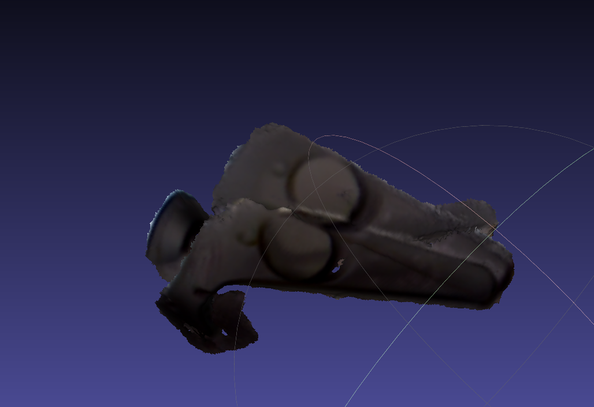
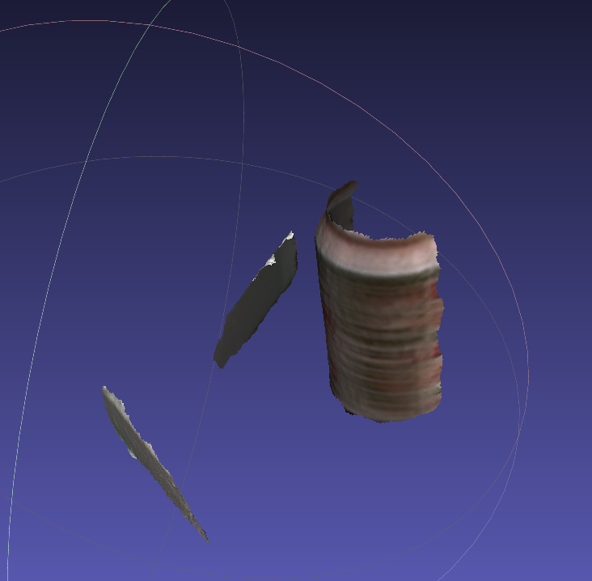
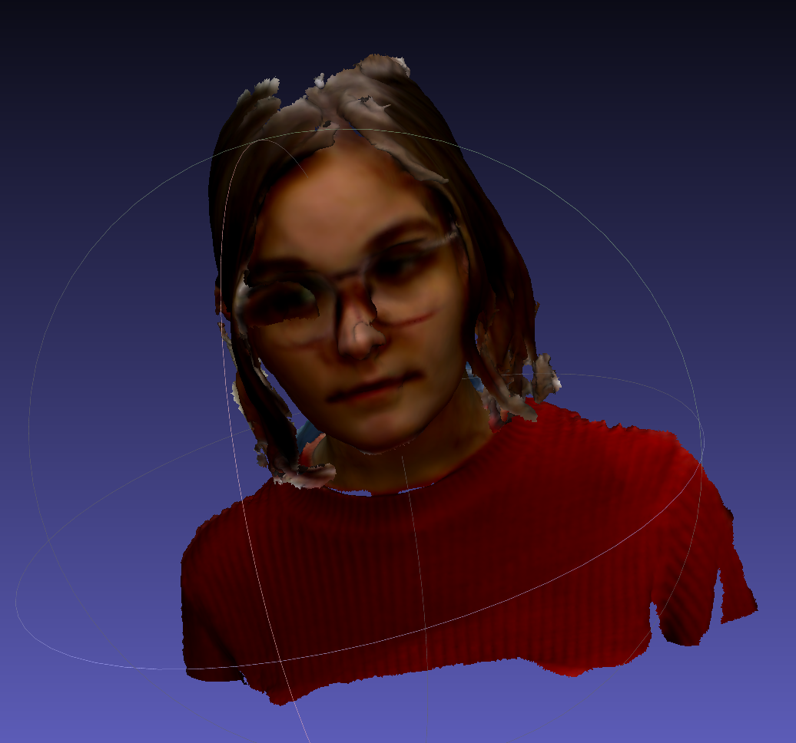
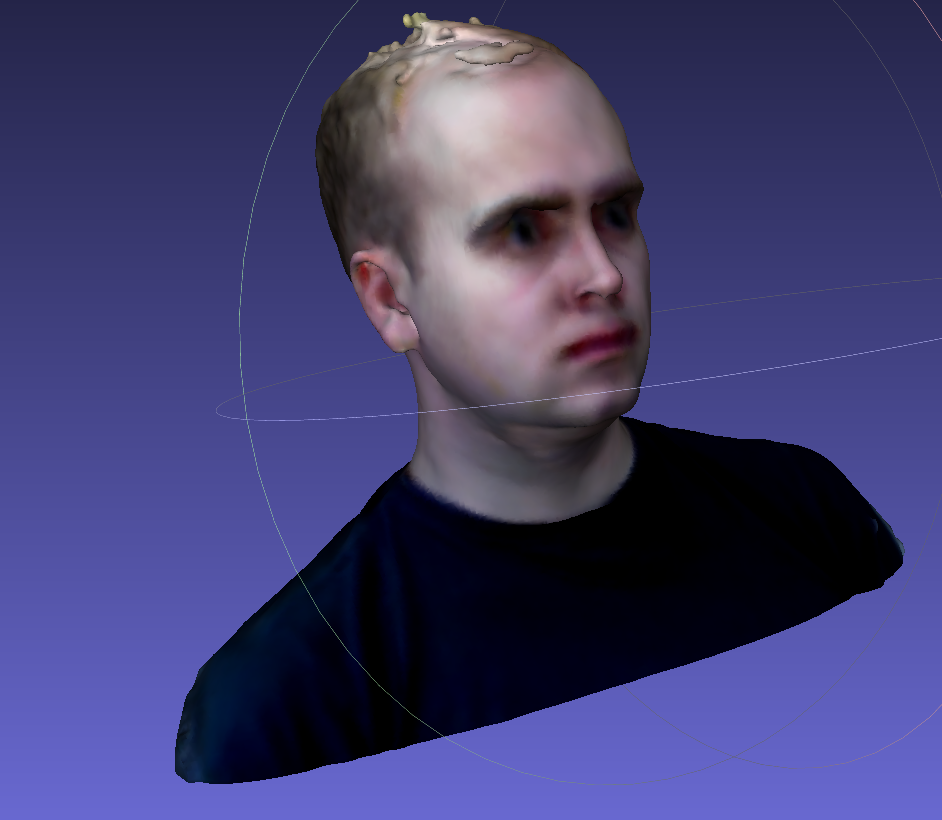
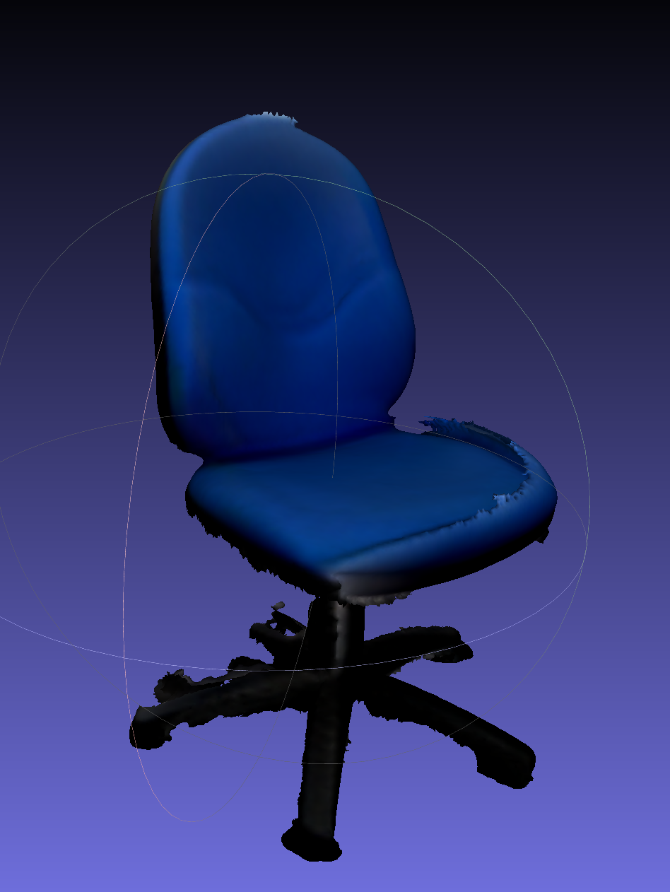
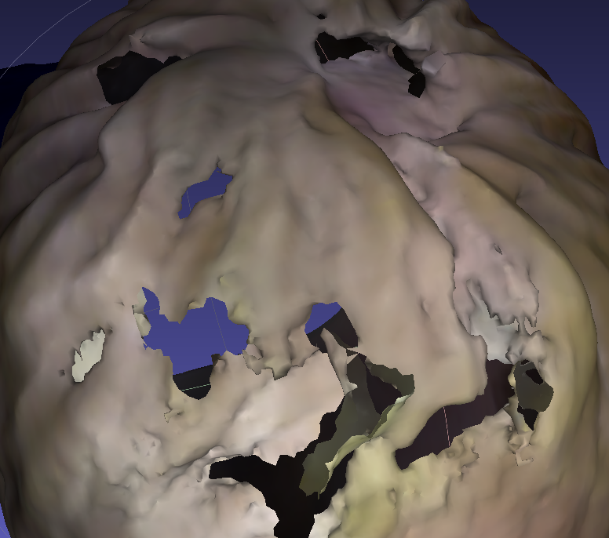
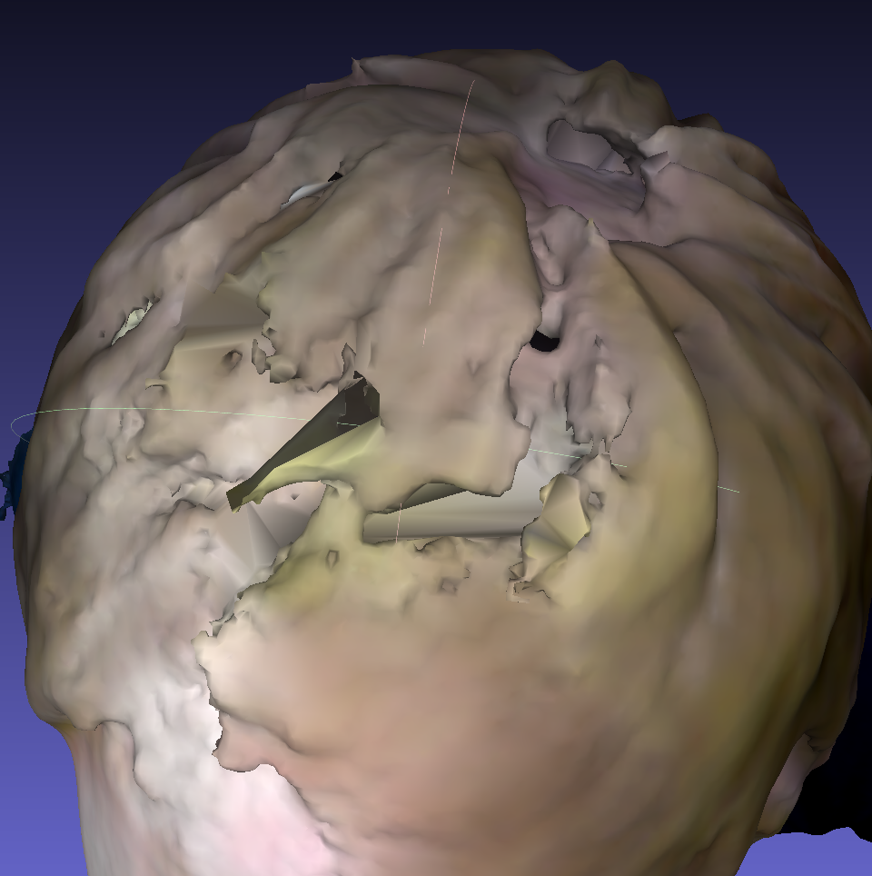
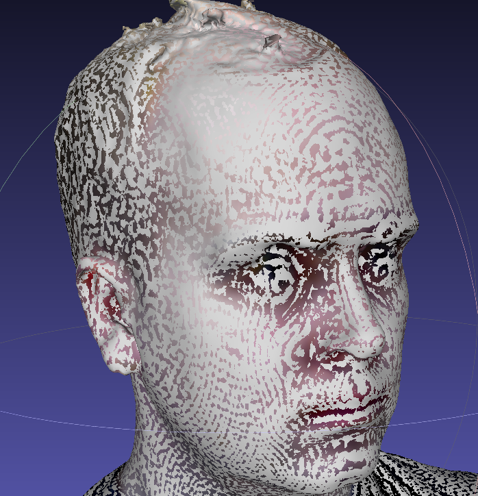

Lab 6-8: Using real world 3D acquisition/modelling techniques
---

- Capture real world objects using 3D acquisition tools
- Use Meshlab to clean and construct a 3D mesh suitable for visualisation
- Upload your 3D mesh to Sketchfab, tag it, and discuss the struggles and gains from platforms like it.

Lab 6
--
The first decision I made was on which technique I would use to build the 3D models, either
with a normal camera or a proper 3D scanner. I chose to use the scanner, in this case the Sense 3D scanner.
Working with my partner, I booked out the scanner and VR room to gather the models.

I chose a list of objects that I would like to gather; me, my partner, a chair, an aluminium can, and a Vive controller.
Capturing these objects with the scanner was far more challenging than I had first thought. 

Starting with the Vive controller, I passed the scanner around the controller trying to achieve a coherent object.
This failed. The fact that it was a difficult object and one of my first objects scanned, it ended up "cloning" itself
due a poor scanning technique. It was almost impossible to rotate the object.

I had the same problem scanning in the drink can. The scanner could be paused
with the software provided, so that rotation could happen without muddying
the model. However the software would get "lost" and not be able to find
a point that it had scanned previously.

More success was found in scanning people. I had my partner sit on a rotating chair,
this allowed me to easily be able to perform a 360° scan of her. This process was repeated to create 
 model of myself.

I also modelled a chair with some success as this was a free-standing object
that I could walk around.

I chose the 3D scanner as my tool of model acquisition as it provided a convenient
and 

Lab 7
--

For this lab I decided to use a model of myself as it was one of the ones with most clarity.
I loaded this 3D model in to Meshlab and began to fixes the problems with the model.

There were a series of holes on top of my head, due to the fact it was difficult to reach and hair
is a complex obejct to model. So I used a re-meshing filter, Close Holes,  to fill in the holes

After using the filter extensively on the little holes around my head, it ended up looking like
this

As you can see there is a massive improvement in the overall mesh in the head. I also filled in 
other holes throughout the rest of the model.

The next step I took was to remove all the artifacts on the model that don't belong there, such
as a rogue piece of hair that the scanner generated, or a piece of nose it thought existed. To do this
I used the selection tool `Select faces in a rectangular region`, and then used the delete tool.
This proved to be tricky as rectangles don't lend themselves as an easy tool to remove triangular faces.

Finally I decided to smooth the model. I used the `Taubin smoothing` filter, along with the 
`Smooth face normals`. Below is the difference that the smoothing had to the model, the grey being
smoothed model. As you can see the smoothing algorithms, smoothed out a significant portion of my head model

The model, in my eyes, was as complete as I could make it, so I exported the model for use
in a later lab.

Lab 8
--
I signed up for a Sketchfab account and uploaded the final model that I produced last week.
This was a smooth and simple process. [Viewable here](https://skfb.ly/6FVBI)

The tags I chose for this object were:

 - peter
 - man
 - face
 - neutral
 - mcneil
 - stare
 - bust

When searching these tags I found that my model ranks highly for certain tags; 
`stare`, `neutral`, and `mcneil`. My model being ranked high for `mcneil` makes sense as there is unlikely to be many models 
labelled that. However, the more interesting tags are the stare, and neutral. These are
both fairly abstract concepts, that aren't necessarily thought of when developers/designers/modellers
upload their models to this search engine.

Sources
---

University of Brighton intranet/lectures

